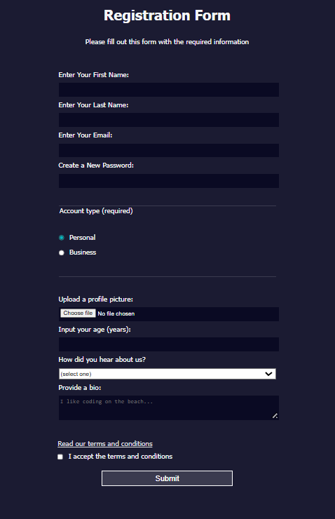

# Registration Form — Things I Figured Out

I built a registration form today and actually got to fix a few styling headaches I usually avoid. Here’s what stuck:

---

## Radio buttons acting as a group

Turns out, giving radio inputs the same `name` attribute (`account-type`) actually makes them behave like a single choice. Before, I’d just click them and wonder why they didn’t toggle off—turns out I was missing that `name` trick.

---

## :last-of-type for borders

I had this weird extra border on the last fieldset. Used `:last-of-type` to target the last element inside and killed just that bottom border. Felt satisfying.

---

## unset for the checkbox reset

The terms & conditions checkbox kept pulling padding or margin from styling the inputs width to 100%. I therefore used `unset` on it and suddenly it sat right next to its label without looking awkward.

---

## vertical-align to keep things in line

The checkbox and label kept drifting apart. I used `vertical-align: middle` on both and they stayed on the same visual line.

---

## Attribute selectors for the submit button

Instead of adding a class on the submit button, I styled it with `input[type="submit"]`. Felt cleaner, more reusable.

---

**Overall**: I learned so much from this project!

---

## Screenshot

